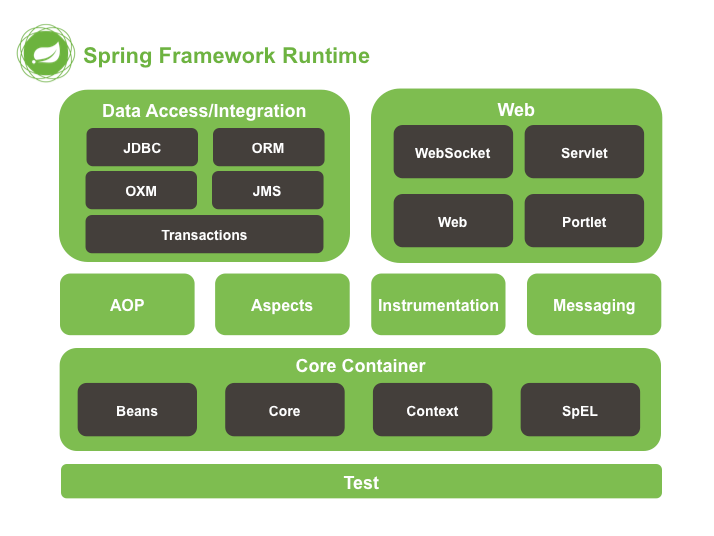

# Spring

Spring 是一个轻量级框架，使用Spring可以简单的实现以前EJB才有的功能，JavaEE的春天

### 内容：
- `依赖注入`：IOC容器
- `面向切面编程`：OP实现
- `数据访问支持`
    - 简化JDBC/ORM
    - 声明式事务
- `WEB集成`

### Spring体系结构:

Spring一共有十几个组件，但是真正的核心组件只有几个

重要的几个模块：
- `core` :核心，DI(IOC)
- `aop` :面向切面编程
- `web`: SpringMVC

