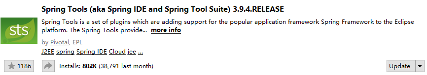
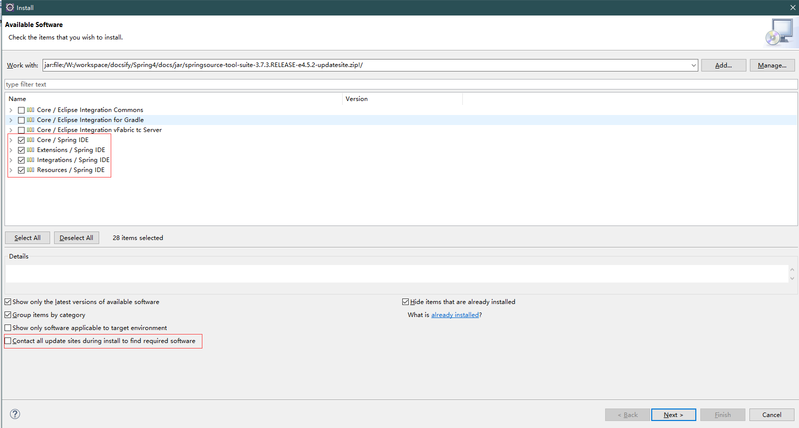
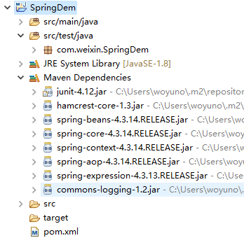
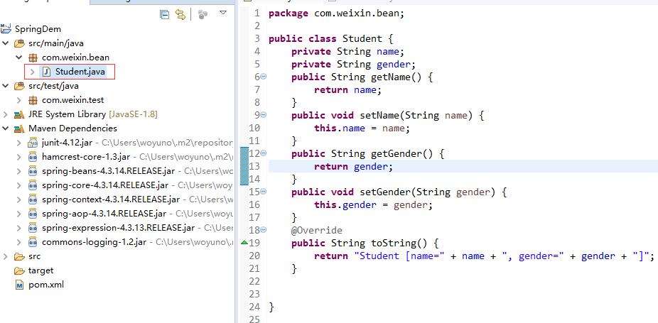
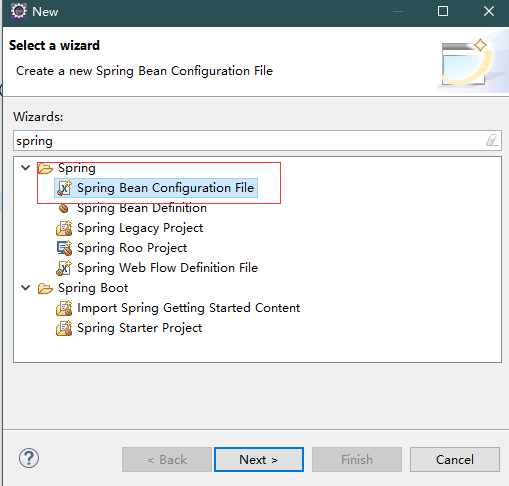

## 环境配置

>安装spring开发插件

本次教程采用eclipse开发工具，为了方便开发，我们需要先安装spring支持插件：spring

- 市场安装 --搜索`spring tools`


- 离线安装



>导入jar包

spring需要beans,core,context,expression(Spel)4个基础包+common-logging附加包
```xml
<dependency>
    <groupId>org.springframework</groupId>
    <artifactId>spring-beans</artifactId>
    <version>4.3.14.RELEASE</version>
</dependency>
<dependency>
    <groupId>org.springframework</groupId>
    <artifactId>spring-core</artifactId>
    <version>4.3.14.RELEASE</version>
</dependency>
<dependency>
    <groupId>org.springframework</groupId>
    <artifactId>spring-context</artifactId>
    <version>4.3.14.RELEASE</version>
</dependency>
<dependency>
    <groupId>org.springframework</groupId>
    <artifactId>spring-expression</artifactId>
    <version>4.3.13.RELEASE</version>
</dependency>
<dependency>
    <groupId>commons-logging</groupId>
    <artifactId>commons-logging</artifactId>
    <version>1.2</version>
</dependency>
```


## HelloWorld

新建bean  --Student


>之前创建对象的传统方式:

```java
public class StudentTest {
	@Test
	public void test1() {
		Student student = new Student();
		student.setName("小明");
		student.setGender("男");
		System.out.println(student);
	}
}
```

>sprign使用方式：

在resource资源文件夹下新建 ->other ->spring


起名applicationContext.xml
```xml
<?xml version="1.0" encoding="UTF-8"?>
<beans xmlns="http://www.springframework.org/schema/beans"
	xmlns:xsi="http://www.w3.org/2001/XMLSchema-instance"
	xsi:schemaLocation="http://www.springframework.org/schema/beans http://www.springframework.org/schema/beans/spring-beans.xsd">

	<!-- 配置bean -->
	<bean id="student" class="com.weixin.bean.Student">
		<property name="name" value="小红"></property>
		<property name="gender" value="女"></property>
	</bean>
</beans>
```
```java
@Test
	public void test2() {
		//1.创建ioc容器对象：
		ApplicationContext applicationContext = new ClassPathXmlApplicationContext("applicationContext.xml");
		//2.从容器中获得维护的Student实例
		//Student student = (Student)applicationContext.getBean("student");
		//2.2
		Student student = applicationContext.getBean(Student.class);
		System.out.println(student);
	}
```
