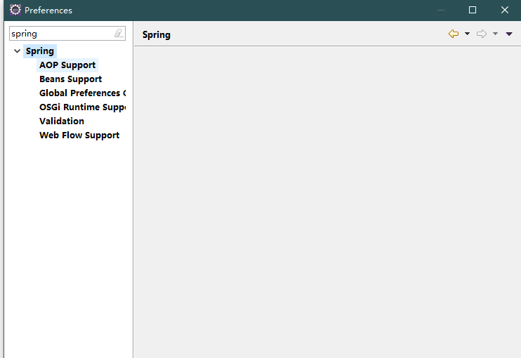

# 起步：

## eclipse 安装插件 

为了方便开发，eclipse需要安装插件:spring tools(spring tool suite)

选择spring ide选项打勾安装

安装完成重启后点击 window -> 搜索spring 出现选择代表安装成功

## 搭建环境

### 新建java普通工程 spring-demo

### 导入jar包

推荐使用maven方式导入jar包

如果要手动导入jar包，则需要打开spring的[github网址：](https://github.com/spring-projects/spring-framework)

1. 点击 `Spring Framework Artifacts`

2. 再点击 `Spring Artifactory`

3. 再点击 `libs-release-local`

4. 再依次点击 org ->springframework -> spring 进入版本列表进行选择下载

把spring的4个核心包导入
[core](jar/spring-core-4.3.16.RELEASE.jar) 
[context](jar/spring-context-4.3.16.RELEASE.jar) 
[beans](jar/spring-beans-4.3.16.RELEASE.jar) 
[experssion](jar/spring-expression-4.3.16.RELEASE.jar) 

导入spring所依赖的[commons-logging-xxx.jar包](_jar/commons-logging-1.1.1.jar)
